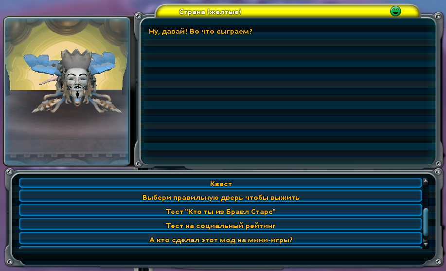
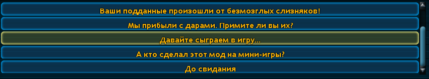
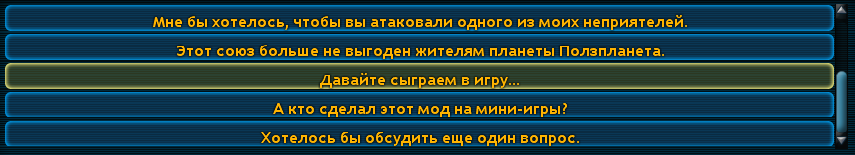

# CNV Prikol (мод на мини-игры)

Мод добавляет мини-игры в панель переговоров.

В моде есть анимации, для того, чтобы музыка воспроизводилась, необходим мод [Prikol](https://www.youtube.com/watch?v=O9_V5AUnSss) или [SmachnayaBEBRA](https://www.youtube.com/watch?v=LRsF8qaEPvQ) (SmachnayaBEBRA включает в себя мод Prikol, по этому вам нужен только 1 из этих модов)

**Важно!!!** Теперь самые новые версии будут выходить на GitHub. Более старые версии вы можете скачать [здесь](https://drive.google.com/file/d/1Jueer9JDW9NOQGzRTtiITEalzLtmc-YC/view?usp=sharing).
___

## Как зайти в мини-игры

Зайти в мини-игры можно только на этапах "Цивилизация" и "Космос".

### На этапе "Цивилизация"

Зайди в панель переговоров с любой страной, пролистай вниз и найди кнопку ***"Давайте сыграем в игру..."***

### На этапе "Космос"

Зайди в панель переговоров > **дипломатия** > ***давайте сыграем в игру...***

___

## Создатели

Мод сделал **RedGrox** (Дух Ияхо)

* [Основной канал](https://www.youtube.com/c/ДухИяхо)
* [Второй канал](https://www.youtube.com/c/КрутойДухИяхо2013)
* [Телеграм](https://t.me/SporeRedGroxMods)
* [spore.com](http://www.spore.com/view/myspore/RedGrox)

Помог перевести на английский [Зеленоид](https://www.youtube.com/channel/UCbJcB6MJciYAmjKKHpkgydA)
